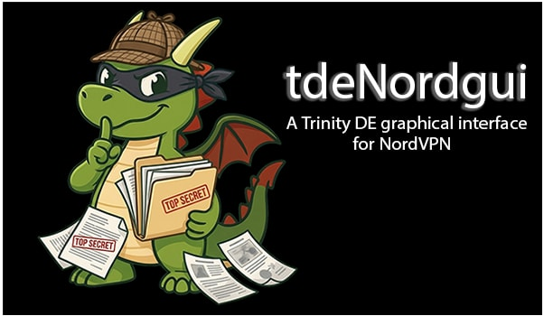
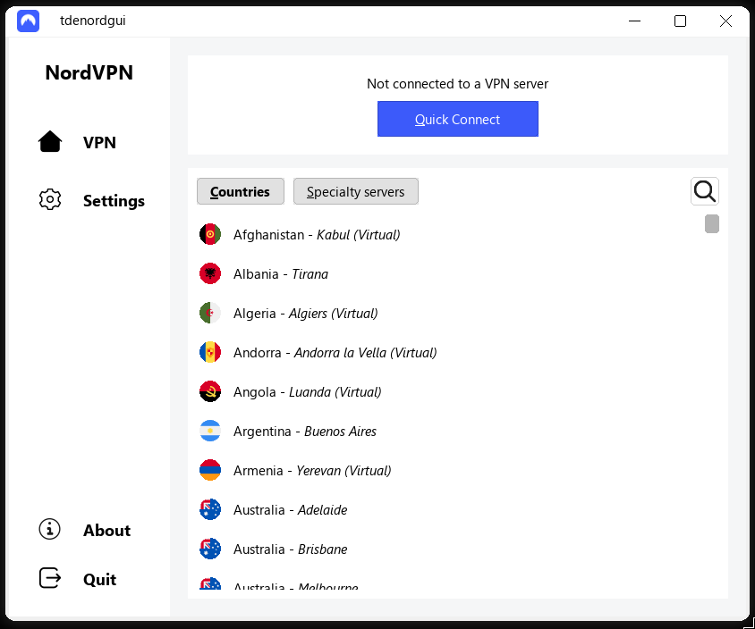
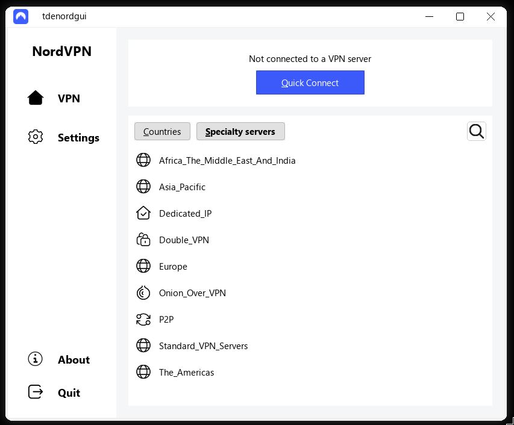
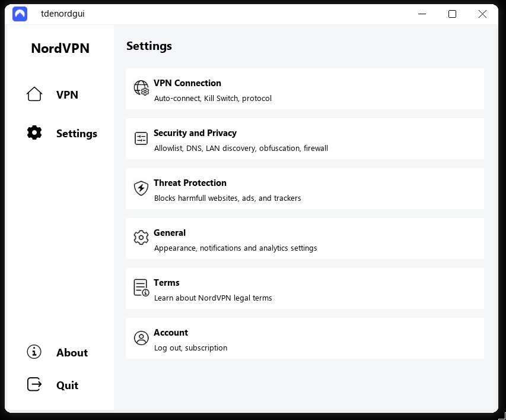
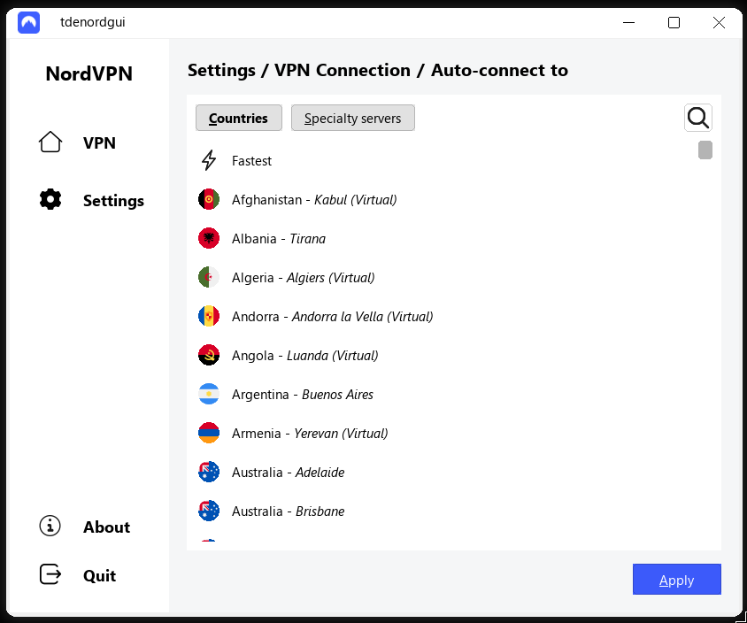
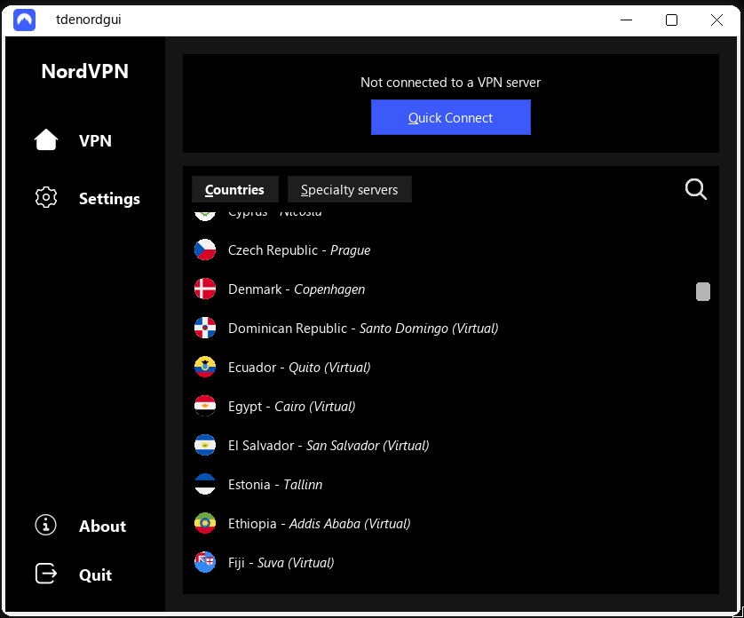
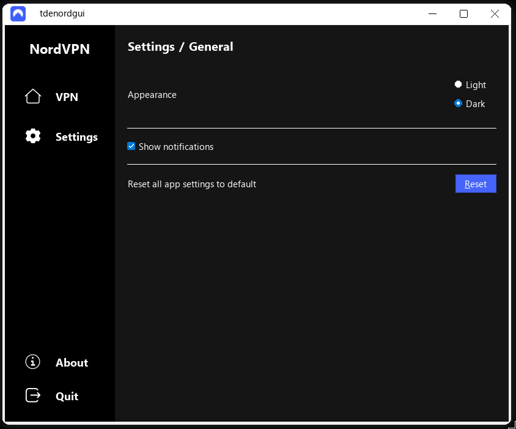
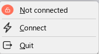
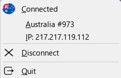

# tdeNordgui : a NordVPN GUI for TDE



A lightning-fast, native, and extremely lightweight graphical interface for the NordVPN Linux CLI, built natively for the **Trinity Desktop Environment (TDE)** using the **TQt3** framework.

This project was built to replace the heavy, electron-style Flutter interface with a C++ native implementation that consumes very little RAM, starts instantly, and integrates perfectly with classic TDE desktop paradigms.

## Features

- **Fast & Lightweight**: The entire compiled executable is roughly **< 700 KB**. Compare this to the ~45MB+ required by the official Flutter application.
- **Native TDE/KDE3 Integration**: Uses `TDEUniqueApplication` to ensure a strict single-instance footprint, native `TDEPopupMenu` for system tray right-clicks, and `TDEAboutData`.
- **Real-Time Daemon Sync**: Communicates directly with the `nordvpnd` Unix socket via gRPC. UI state is updated instantly in real-time.
- **Dynamic System Tray**: Persistent tray icon reflecting the live connection status (disconnected, connecting, connected to specific servers) with a fully integrated context menu.
- **Theming**: Fully supports native light and dark modes with hot-swappable color palettes without heavy CSS styling.
- **Advanced Settings Control**: Read and manage NordVPN advanced capabilities (Threat Protection, Custom DNS, Allowlisting) natively.
- **Native Notifications**: Uses `libnotify` for lightweight system popup alerts upon connection state transitions.

## Compilation & Dependencies

### Prerequisites

You will need the Trinity Desktop development suites, Qt3/TQt3 headers, and the gRPC/Protobuf compiler chains.

On Debian/Ubuntu-based system with the TDE repository enabled:
```bash
sudo apt install build-essential cmake pkg-config libtqt3-mt-dev tdelibs14-trinity-dev libnotify-dev libgrpc++-dev libprotobuf-dev protobuf-compiler protobuf-compiler-grpc
```

### Daemon Installation (Required)

This GUI is a native frontend that communicates directly with the official NordVPN daemon. You must install the **CLI-only version** of NordVPN (the official electron GUI version can technically cohabit, but the CLI version is strongly recommended for a pure native experience).

Install the CLI version directly using NordVPN's official script:
```bash
sh <(curl -sSf https://downloads.nordcdn.com/apps/linux/install.sh)
```
If you do not have `curl` installed, you can use `wget` instead:
```bash
sh <(wget -qO - https://downloads.nordcdn.com/apps/linux/install.sh)
```

Once installed and logged in via the CLI, simply launch `tdenordgui`!

### Source Tree Context (Important)

This frontend strictly depends on the NordVPN daemon's `.proto` schemas to generate the local C++ gRPC stubs. 
The `CMakeLists.txt` is configured to look for these schemas **outside** of this directory at:
`../../protobuf/`

Ensure that the repository maintains this structure:
```text
nordvpn-linux/
├── protobuf/
│   └── daemon/
│       ├── service.proto
│       ├── status.proto
│       └── ...
└── gui/
    └── tqt/
        ├── src/
        ├── CMakeLists.txt
        └── README.md
```

### Build Instructions

**Automated Build (Recommended)**
A fully automated compilation script is provided to cleanly reconstruct the application and all embedded C++ icon headers from scratch. This ensures any custom `.png` icons you modify are seamlessly translated into static arrays before compilation (`xxd` utility required).

```bash
./build.sh
```

To entirely reset and sanitize your workspace before a repository push (wiping the `build/` directory and generated icon headers):
```bash
./clean.sh
```

**Manual Build (Classic)**
If you simply want to recompile the project without regenerating the icon arrays:
```bash
mkdir build && cd build
cmake ..
make -j$(nproc)
```

The resulting binary `tdenordgui` will be generated in the `build/` directory.

## Troubleshooting

- **"Failed to connect to the NordVPN daemon" at startup**: 
  Ensure the NordVPN backend service is running (`sudo systemctl start nordvpnd` or `sudo service nordvpn start`). The UI expects the socket to be available at `/run/nordvpn/nordvpnd.sock`.
- **Missing `/opt/trinity` paths error**: 
  If CMake fails to find Trinity, ensure your environment variables are set or manually adjust the `include_directories` paths in `CMakeLists.txt` to match your specific TDE layout (e.g. `/usr/include/trinity`).

## Credits & Disclaimer

Built for the Trinity Desktop Environment community prioritizing speed, bloat-free development, and native aesthetics. 

**Disclaimer**: This project is not affiliated with, endorsed by, or sponsored by NordVPN. It is an independent initiative created by a user who simply wanted a "better", lightweight graphical interface natively integrated into TDE.

## Some screenshots:









